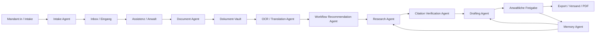
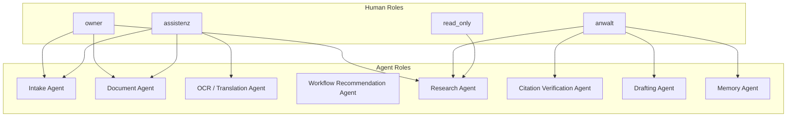
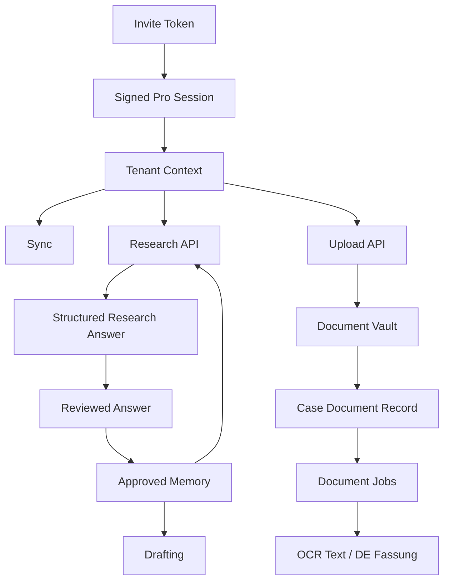
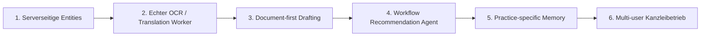

# GitLaw Agent Visual Map

## 1. Gesamtbild



Kurz:

- links kommt rohes Material rein
- in der Mitte arbeiten spezialisierte Agenten
- rechts bleibt die Freigabe beim Menschen
- unten speichert Memory nur freigegebene Qualitaet

## 2. Rollenkarte



## 3. Wer darf was

```text
owner
- Einstellungen
- Vollzugriff
- Kanzlei-Konfiguration

anwalt
- Recherche freigeben
- DE-Fassung freigeben
- Schreiben finalisieren
- Memory erzeugen

assistenz
- Fälle anlegen
- Intake übernehmen
- Dokumente hochladen
- OCR/Translation anstoßen
- Recherche/Draft vorbereiten

read_only
- lesen
- kein schreibender Eingriff
```

## 4. Agenten einzeln

### Intake Agent

```text
Input:
- Formularfelder
- Freitext
- Datei-Metadaten

Output:
- strukturierter Eingang
- Dringlichkeit
- Fristsignal
- offene Rückfragen
```

Stand heute:

- teilweise real
- Intake-Struktur, Triage-Felder und Review-Flow existieren
- noch kein autonomer serverseitiger Klassifikator

### Document Agent

```text
Input:
- hochgeladene Datei
- Akte
- Kategorie / Sprache

Output:
- interner Dateiname
- Dokument-Metadaten
- Zuordnung zur Akte
- Vault-Referenz
```

Stand heute:

- real
- Dateibenennung, Kategorisierung, Sprachhinweis, Aktenzuordnung existieren

### OCR / Translation Agent

```text
Input:
- Dokument
- Sprache
- gewünschte Zielverarbeitung

Output:
- OCR-Text
- DE-Arbeitsfassung
- Review-Status
```

Stand heute:

- Job-System real
- eigentliche Verarbeitung noch Beta-Stub

### Workflow Recommendation Agent

```text
Input:
- Fallstatus
- Fristen
- Dokumentlage
- letzte Arbeitsschritte

Output:
- nächster bester Schritt
- Alternativen
- Begründung
```

Stand heute:

- konzeptionell definiert
- noch nicht als eigener laufender Agent implementiert

### Research Agent

```text
Input:
- Frage
- Aktenkontext
- freigegebenes Memory

Output:
- strukturierte juristische Antwort
- zitierte Normen
- knappe Begründung
```

Stand heute:

- real
- serverseitig authentifiziert
- JSON-Schema-Output

### Citation Verification Agent

```text
Input:
- strukturierte Zitate
- Gesetzeskorpus

Output:
- verifiziert / unsicher
- Paragraphenbezug
- Textauszug
```

Stand heute:

- teilweise real
- strukturierte Zitatlogik existiert
- noch nicht als vollständig separater Dienst

### Drafting Agent

```text
Input:
- Akte
- Recherche
- Vorlage
- Rechtsgrundlagen
- Kanzlei-Memory

Output:
- erster Entwurf
- bearbeitbare Fassung
- final freigebare Version
```

Stand heute:

- real als Produktflow
- noch nicht maximal an Dokumente + Memory gekoppelt

### Memory Agent

```text
Input:
- nur freigegebene Antworten
- nur freigegebene Fassungen

Output:
- wiederverwendbare Kanzlei-Muster
- bessere Recherche-Kontexte
- bessere Drafting-Vorschläge
```

Stand heute:

- realer Startpunkt
- approved-answer memory existiert
- noch keine tiefe strukturierte Langzeitlogik

## 5. Datenfluss



## 6. Was heute schon echt ist

```text
Echt:
- signierte Session mit tenantId + role
- serverseitig geschützte Pro-API
- tenant-gebundener Sync
- serverseitiger Dokument-Vault als Beta-Adapter
- Dokument-Upload in Fälle
- OCR/Translation-Jobqueue
- Research Agent mit strukturiertem Output
- freigegebenes Answer Memory

Noch nicht voll:
- echter OCR-Provider
- echter Translation-Provider
- serverseitige Persistenz aller Entities
- Recommendation Agent
- tiefer Citation-Verifier als eigener Dienst
- stärkerer Drafting-Agent mit voller Akten-/Dokumentnutzung
```

## 7. Nächste Ausbaureihenfolge



## 8. Das Entscheidende

GitLaw ist nicht:

- ein Chatbot fuer Anwalt:innen

GitLaw ist:

- ein beaufsichtigtes Multi-Agent-Workflow-System fuer Kanzleien

Der Mensch bleibt:

- Entscheider:in
- Freigeber:in
- Haftungstraeger:in

Die Agenten uebernehmen:

- Struktur
- Vorarbeit
- Vorschlaege
- Geschwindigkeit
- Wiederverwendung
